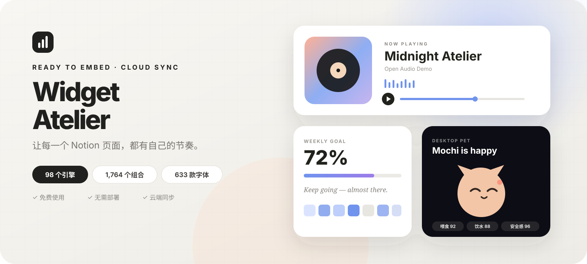

<p align="center">
  <a href="https://widget.imnotfound.eu.org/">
    
  </a>
</p>

<h1 align="center">Widget Atelier</h1>

<p align="center">
  把你的 Notion，变成真正属于你的空间。
  <br />
  选择组件，实时定制，复制永久链接即可使用；动态状态由我们托管同步。
</p>

<p align="center">
  <a href="https://widget.imnotfound.eu.org/"></a>
  <a href="https://widget.imnotfound.eu.org/"></a>
  <a href="https://github.com/zengyincen/notion-widget-atelier"></a>
  <a href="./LICENSE"></a>
  <a href="https://github.com/zengyincen/notion-widget-atelier/stargazers"></a>
  <a href="https://github.com/zengyincen/notion-widget-atelier/commits/main"></a>
</p>

<p align="center">
  <a href="./README.en.md">English README</a>
  ·
  <a href="https://widget.imnotfound.eu.org/"><strong>挑选我的第一个组件</strong></a>
  ·
  <a href="https://widget.imnotfound.eu.org/?category=feature-pet">领养桌面宠物</a>
  ·
  <a href="./docs/NOTION-DATABASE.zh-CN.md">连接公开 Notion 数据</a>
</p>

<p align="center">
  <a href="https://widget.imnotfound.eu.org/">
    
  </a>
</p>

## 你可以用它做什么

Widget Atelier（旧名 Notion Widget Box）是我们为 Notion 用户提供的在线小组件服务。你无需下载代码、申请服务器或配置密钥，打开组件库就能直接使用。

> **SEO / AI 搜索入口：** [Notion widgets 完整指南](https://widget.imnotfound.eu.org/guides/notion-widgets.html) 汇总了嵌入方法、选型标准，以及 Indify、Apption、Plus AI、Widgetly、NotionBox、Widgets For Notion 和 Wotion 的公开定位对照。

| | 你会得到 | 使用体验 |
| --- | --- | --- |
| 🔎 | 98 个组件 | 搜索、分类、收藏和预览，每种组件在首页只出现一次 |
| 🎨 | 深度定制 | 自由调整颜色、字体、尺寸、圆角、布局、语言、地区与时区 |
| 🐾 | 独立动态宠物 | 每只宠物拥有独立身份，跨设备同步饱腹、水分和安心状态 |
| 📊 | 进度与热力图 | 支持手动数据、Notion Formula 与公开数据库聚合 |
| 🎵 | 音乐与艺术 | 歌单、LRC、黑胶、磁带、氛围混音、诗词和生成艺术 |
| 🔗 | 永久嵌入链接 | 定制结果写入链接，复制后即可长期放在 Notion 中 |

<p align="center">
  <strong>98</strong> 个组件引擎&nbsp;&nbsp;·&nbsp;&nbsp;
  <strong>1,764</strong> 个主题与布局组合&nbsp;&nbsp;·&nbsp;&nbsp;
  <strong>633</strong> 款字体（53 款中文）&nbsp;&nbsp;·&nbsp;&nbsp;
  <strong>0</strong> 个用户部署步骤
</p>

## 三步放进 Notion

1. 打开[在线组件库](https://widget.imnotfound.eu.org/)，搜索或筛选喜欢的组件。
2. 在实时预览中调整内容、颜色、字体、主题和尺寸，然后点击“复制链接”。
3. 在 Notion 输入 `/embed`，粘贴链接并确认。

无需注册，也无需填写 Worker 地址。音乐、天气等联网组件会直接访问各自的公开数据源；宠物状态和公开 Notion 数据聚合由我们的 Cloudflare 服务统一托管。

## 值得先试的组件

### 🐾 领养一只真正属于你的桌面宠物

先预览猫咪、小狗、兔子或软团子的样子，选定后再填写主人昵称和宠物名。系统会自动生成随机身份码，即使名字相同，也不会和别人的宠物撞车。

- 宠物会随时间感到饿、渴或需要陪伴，并改变表情、动作、Emoji 和小气泡。
- 喂食、喂水和抚摸都直接在组件内部完成并即时更新，不会打开或跳转到其他页面。
- 喂食与喂水各有独立的两小时冷却；按钮会直接显示何时可以再次照顾。
- 每次抚摸都会播放开心动画，并把安心状态同步到同一个永久嵌入链接。
- 每个宠物 ID 对应一个独立的 Cloudflare Durable Object，状态不会串到其他用户。

### 📊 让公开 Notion 数据自己变成进度

如果你希望进度条或热力图跟随数据库变化，只需把对应数据库页面设为公开，然后在定制器点击“安全连接 Notion 数据库”。

我们不会要求 Integration Token。托管连接器只返回列结构和组件需要的聚合结果，不会把完整数据行交给组件。详细步骤见[公开数据连接说明](./docs/NOTION-DATABASE.zh-CN.md)。

> 公开页面本身可能被任何拿到链接的人访问。请勿发布姓名、邮箱、客户资料、内部项目或其他敏感数据。

### 🎵 把音乐和艺术留在工作区里

- 音乐播放器支持公开音频直链、手动歌单、Meting 资源、LRC 歌词和播放列表。
- 黑胶唱片机、复古磁带机、氛围混音和动态歌词提供不同的视觉与交互形式。
- 竖排诗笺、景深引言、专辑封面、粒子、波浪与极光组件适合打造更有个人气质的页面。

浏览器或 Notion 可能阻止自动播放，首次手动点击播放后即可正常使用。请确保音频来源与使用方式符合版权要求。

## 组件目录

| 分类 | 代表组件 |
| --- | --- |
| 时间与日期 | 数字、模拟、翻页与文字时钟，Google 日历、日程构建器、倒计时、世界时钟、年月周日进度 |
| 效率与专注 | 番茄待办、重复任务、记忆闪卡、习惯追踪、学习场次、呼吸练习、优先矩阵 |
| 进度与数据 | 数据库进度、圆环、分段里程碑、KPI、柱状图、环图、日历与连续打卡热力图 |
| 音乐与艺术 | 音乐播放器、黑胶、磁带、氛围混音、动态歌词、诗笺、引言和生成艺术 |
| 动态与生活 | 桌面宠物、虚拟植物、专注花园、情绪轨道、加密行情、每日卡牌、储蓄目标 |
| 信息与文化 | 新闻摘要、天气、塔罗、祈祷时间、黄历、星座、节气、月相和每日语录 |
| 工具与链接 | 随身白板、反馈表单、配色板、ASCII、计算器、二维码、导航、社交链接和按钮 |

完整的参考项目覆盖情况见[组件覆盖说明](./docs/REFERENCE-COVERAGE.zh-CN.md)。

## 自定义能力

| 范围 | 可调内容 |
| --- | --- |
| 视觉 | 6 套主题、背景、卡片、文字、强调色、边框、阴影和透明外层 |
| 字体 | 中文优先：黑体、宋体、仿宋、楷体、圆体、艺术、手写、像素和等宽字体；另有 500+ 款国际字体 |
| 结构 | 紧凑、标准、宽幅，支持缩放、内边距、圆角和对齐方式 |
| 本地化 | 语言、时区、地区、城市、日期和时间格式 |
| 内容 | 标题、正文、图片、链接、音频、歌单、歌词、目标值和数据源 |
| 动态 | 动画、速度、随机种子、交互状态、自动轮播和刷新行为 |

字体选择器默认只展示 53 款中文字体，也可切换到“全部字体”或“国际字体”。新增的得意黑、思源黑体/宋体、霞鹜文楷、朱雀仿宋、小赖字体、寒蝉系列、方舟/缝合像素字体、更纱与 Maple Mono 等均已核验为 [SIL OFL 1.1](https://openfontlicense.org/)；WebFont 由 [ZSFT](https://fonts.zeoseven.com/) 按需加载。原有 Google Fonts 同样采用开源许可。字体服务不可用时，组件会自动回退到系统中文字体。

## 隐私与安全

- 我们不要求用户提交 Notion Integration Token、Cloudflare 密钥或 GitHub 凭证。
- 普通组件配置写在生成链接中；部分纯本地交互状态保存在浏览器 `localStorage`。
- 动态宠物仅保存随机宠物 ID 与饱腹、水分、安心和操作时间，不保存邮箱。
- 访问与使用统计只保存由 Cloudflare Worker HMAC 匿名化后的去重标识，不保存原始 IP、姓名或邮箱。
- 公开 Notion 连接只接受 `notion.so` / `notion.site` 链接，并只返回列结构或聚合值。
- 黄历、星座和运势内容仅供娱乐，不构成专业建议。

## 常见问题

**需要自己部署吗？**<br />
不需要。终端用户直接使用在线组件库，我们负责托管 GitHub Pages 前端和 Cloudflare 同步服务。

**需要账号吗？**<br />
普通组件和宠物领养都无需注册。请保存生成的嵌入链接；链接中包含你的组件配置与随机宠物 ID。

**宠物重名会互相影响吗？**<br />
不会。显示名称和存储身份分开，每次领养都会生成独立随机 ID。

**能读取私有 Notion 数据库吗？**<br />
不能。连接器只读取你主动发布的公开页面，也不会尝试绕过 Notion 权限。

## 面向维护者

终端用户不需要阅读这一节。以下内容用于维护本服务、贡献代码或部署自己的副本。

### 架构

- `widget.imnotfound.eu.org`：由 Cloudflare 代理的组件市场、定制器与统一 `widget.html` 嵌入入口。
- `nwb.imnotfound.eu.org`：Cloudflare Worker 公共 API、Notion 公开数据聚合与 60 秒缓存。
- Durable Objects：按随机 `petId` 分片，每只宠物一个强一致 SQLite 对象。
- 管理员重置：通过 Worker Secret `RESET_SECRET` 保护，不进入浏览器代码或链接。

### 本地运行

```bash
git clone https://github.com/zengyincen/notion-widget-atelier.git
cd notion-widget-atelier
python3 -m http.server 4173
```

访问 `http://localhost:4173/`。Cloudflare 服务的部署与运维说明见 [`worker/README.md`](./worker/README.md)。

### 项目结构

```text
.
├── index.html                  # 组件市场与可视化定制器
├── widget.html                 # 统一 Notion 嵌入入口
├── connect.html                # 公开 Notion 数据连接页
├── assets/
│   ├── service.js              # 官方托管服务地址
│   ├── catalog.js              # 组件、主题和布局注册表
│   ├── fonts.js                # 633 款字体目录（中文优先）
│   ├── app.js                  # 搜索、筛选、收藏和定制器
│   └── widget.js               # 组件引擎与交互
├── worker/                     # Cloudflare Worker 与 Durable Object
├── docs/                       # 使用说明、市场调研与覆盖说明
└── .github/workflows/          # GitHub Pages 自动部署
```

欢迎提交新组件、主题、修复和文档改进。提交新组件时，请同时更新组件目录、对应渲染器、样式和覆盖说明。

## 许可证与致谢

本项目采用 [MIT License](./LICENSE)。产品范围参考了以下开源项目和社区实践：

- [ShoroukAziz/notion_widgets](https://github.com/ShoroukAziz/notion_widgets)
- [RylanBot/awesome-notion-widgets](https://github.com/RylanBot/awesome-notion-widgets)（MIT）
- Notion 组件社区中的公开分类、交互和嵌入方式

本项目的组件注册表、播放器、交互和视觉均为独立的数据驱动实现。Notion 是其各自权利人的商标，本项目与 Notion 官方无隶属或背书关系。

---

<p align="center">
  喜欢这个组件工坊？欢迎点一个 ⭐，也欢迎告诉我们你还想看到什么。
</p>
